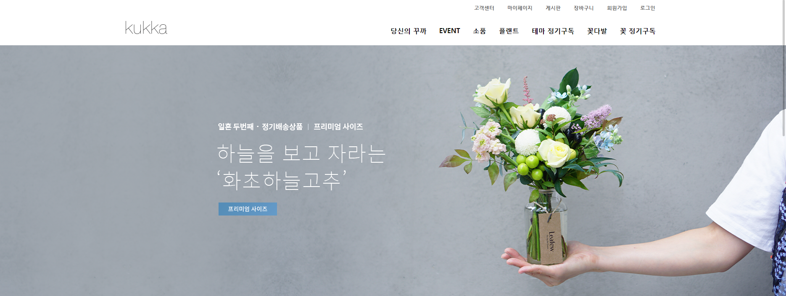

- 웹소스주소 : 

- 개발자 : 

- 개발기간 :  4일  -  2017년  09월

- 서버 환경 : Tomcat 8.5.x / JSP 2.3 / Servlet 3.1 / JDK 1.8.x / window7 / oracle11g

- 프레임워크 : 모델1 방식

- 개발 툴 : eclipse neno.3

- CRUD 작업 :  3 여개

- ORM(Object Relation Mapping) -  아님,   

 
- 디자인 :  일반유저화면, 부트스트랩 

- 보안 : PreparedStatement 처리로 SQL Injection 보안

- 스킬 : java, jsp, html, css, bootstrip, javascript

# 1. 메인화면

  
  

## 설명 

### 메인화면에 header와 banner 부분을 캡쳐하였다.
### 헤더에는 고객센터,마이페이지,게시판,장바구니,회원가입,로그인으로 작성하였고 nav부분에는 각종 꽃구독 사이트에 중요한 메뉴바로 구성해났다.
### 여기서 로그인,회원가입,게시판 기능을 구현할려고 하였지만 게시판 기능은 아직 구현하지 못하였고 로그인,회원가입 부분만 기능 구현을 해났다.

----------------------------------------------------------------------------------------------------------------------------------------------

# 2. 로그인화면

  
  

## 설명 

### 로그인 화면에서는 아이디,비밀번호를 제대로 입력하면 로그인이 성공하고 만약 틀릴시 화면에 "아이디를 확인해주세요", "비밀번호를 확인해주세요" 문구가 
### 뜨게 설정해났다. 아이디를 입력하지 않았으면 alert로 아이디를 입력해주세요 비밀번호가 틀리면 alert로 비밀번호를 입력해주세요 문구가 나온다.

----------------------------------------------------------------------------------------------------------------------------------------------

#  3. 회원가입화면

  
  

## 설명 

### 회원가입 화면은 회원에 개인정보를 입력하고 가입 버튼을 누르면 회원가입 완료가 되었다는 페이지로 이동하게된다.
### MVC2 방식으로 BEAN에 저장되어 있는 값들을 DAO에서 불러와 DB로 연동 시켜 소스를 완성하였다.

----------------------------------------------------------------------------------------------------------------------------------------------

#  4. 회원가입 중복화면

  
  

## 설명 

### 중복확인 버튼을 클릭하면 window창이 생성되는데 request.getParameter를 사용하여 id 값에서 중복되는 값이 있는지 없는지 확인하고 값이 1이 나오면 사용할
### 수 없는 값이아이디 입니다. 라는 문구가 나오고  0값이 되면 사용가능한 아이디입니다. 라는 문구가 나오게 하였다.

----------------------------------------------------------------------------------------------------------------------------------------------

#  5. 회원가입완료화면

  
  

## 설명 

### 회원가입이 완료되면 뜨는 화면이다. DAO에 저장되 있는 insertMember 메소드를 불러와 Bean에 저장되어 있는 String 값을 <%= %>

----------------------------------------------------------------------------------------------------------------------------------------------

#  

  
  

## 설명 

### 로그인 화면에서는 아이디,비밀번호를 제대로 입력하면 로그인이 성공하고 만약 틀릴시 화면에 "아이디를 확인해주세요", "비밀번호를 확인해주세요" 문구가 

----------------------------------------------------------------------------------------------------------------------------------------------

#  

  
  

## 설명 

### 로그인 화면에서는 아이디,비밀번호를 제대로 입력하면 로그인이 성공하고 만약 틀릴시 화면에 "아이디를 확인해주세요", "비밀번호를 확인해주세요" 문구가 

----------------------------------------------------------------------------------------------------------------------------------------------

#  

  
  

## 설명 

### 로그인 화면에서는 아이디,비밀번호를 제대로 입력하면 로그인이 성공하고 만약 틀릴시 화면에 "아이디를 확인해주세요", "비밀번호를 확인해주세요" 문구가 

----------------------------------------------------------------------------------------------------------------------------------------------

#  

  
  

## 설명 

### 로그인 화면에서는 아이디,비밀번호를 제대로 입력하면 로그인이 성공하고 만약 틀릴시 화면에 "아이디를 확인해주세요", "비밀번호를 확인해주세요" 문구가 

----------------------------------------------------------------------------------------------------------------------------------------------

#  

  
  

## 설명 

### 로그인 화면에서는 아이디,비밀번호를 제대로 입력하면 로그인이 성공하고 만약 틀릴시 화면에 "아이디를 확인해주세요", "비밀번호를 확인해주세요" 문구가 

----------------------------------------------------------------------------------------------------------------------------------------------

#  

  
  

## 설명 

### 로그인 화면에서는 아이디,비밀번호를 제대로 입력하면 로그인이 성공하고 만약 틀릴시 화면에 "아이디를 확인해주세요", "비밀번호를 확인해주세요" 문구가 

----------------------------------------------------------------------------------------------------------------------------------------------

#  

  
  

## 설명 

### 로그인 화면에서는 아이디,비밀번호를 제대로 입력하면 로그인이 성공하고 만약 틀릴시 화면에 "아이디를 확인해주세요", "비밀번호를 확인해주세요" 문구가 

----------------------------------------------------------------------------------------------------------------------------------------------
